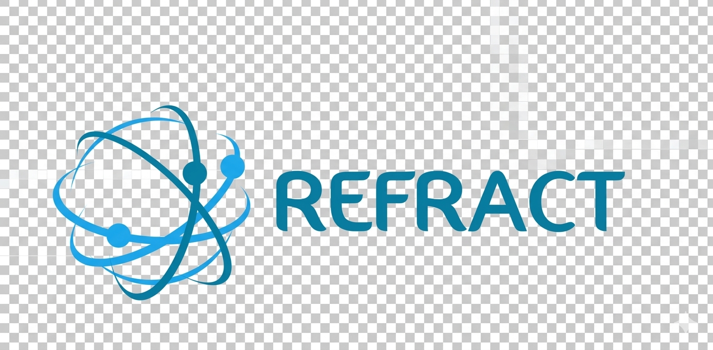

<p align="center">
  
</p>

# Refract

> Cuts up to 97% of the tokens your AI agents spend using MCP tools — without losing anything.

---

## The problem in one sentence

When your AI agent (Claude, Cursor...) connects to an external tool — your calendar, your emails, GitHub — it downloads **the full description of every available tool**, every single time, even if it only ends up using one.

It's like asking someone to read the entire store catalogue just to buy bread.

**Refract fixes that.** It sits between your agent and the tool server, and only lets through what's actually needed.

---

## What it actually changes

| | Without Refract | With Refract |
|---|---|---|
| Filesystem tools (14 tools) | 1,892 tokens | 236 tokens (**−88%**) |
| Google Calendar tools (5 tools) | 5,010 tokens | 660 tokens (**−87%**) |
| Enterprise pack — Calendar + Gmail + Drive (12 tools) | 8,649 tokens | 882 tokens (**−90%**) |

Fewer tokens sent = lower API bills, faster responses.

**And nothing is lost.** Every check confirmed tools stay 100% usable after compression and no required information is ever stripped.

---

## Install

```bash
pip install refract-mcp
```

That's it. No API key required, no account needed.

---

## How to use it

### With Claude Desktop

Open your Claude Desktop config file and add:

```json
{
  "mcpServers": {
    "my-tool-via-refract": {
      "command": "refract-proxy",
      "args": [
        "--target",
        "npx @modelcontextprotocol/server-filesystem /path/to/folder",
        "--verbose"
      ]
    }
  }
}
```

Replace the `--target` line with any MCP server you already use. Restart Claude Desktop and that's it, Refract runs in the background.

You may have this message when launching Claude Desktop :**"Failed to spawn process: No such file or directory" in Claude Desktop**

This usually means Claude Desktop can't find `refract-proxy` in its PATH. Find the absolute path and use it directly in your config:

```bash
which refract-proxy
```

Then use the full path in `claude_desktop_config.json`:

```json
{
  "mcpServers": {
    "my-tool-via-refract": {
      "command": "/full/path/to/refract-proxy",
      "args": [
        "--target",
        "npx @modelcontextprotocol/server-filesystem /path/to/folder",
        "--verbose"
      ]
    }
  }
}
```

---
### From the command line

```bash
refract-proxy --target "npx @modelcontextprotocol/server-filesystem /tmp" --verbose
```

The `--verbose` flag shows live savings:

```
[Refract] Connected to npx @modelcontextprotocol/server-filesystem /tmp
  14 tools  |  1892 → 236 tokens  (88% reduction)
```

---

## How it works, no jargon

Refract optimizes information retrieval by sending an agent a simple index of tool names instead of a massive summary of all available data. Once the required tool is identified, the system delivers only the necessary full details and automatically verifies that no important content was lost during the compression. Operating completely without artificial intelligence, this streamlined process is entirely automated, fast, and predictable.

---

## Works with

- Claude Desktop
- Cursor
- Any client that follows the MCP (Model Context Protocol) standard
- Any existing MCP server — your internal tools, GitHub, Google Workspace, Slack, etc.

---

## For developers

### Python usage

```python
from refract_proxy import RefractProxy

proxy = RefractProxy(
    target_url="npx @modelcontextprotocol/server-filesystem /tmp",
    verbose=True,
)
await proxy.connect()

# Use compressed tools directly with the Anthropic API
tools = proxy.as_anthropic_tools(use_cache=True)

# Or serve as a local MCP server (stdio)
await proxy.serve()

# Or expose it via HTTP/SSE
await proxy.serve_http()  # → http://localhost:8080/sse
```

### HTTP/SSE mode

```bash
refract-proxy --target "https://my-mcp-server.com" --mode http --port 8080
```

### With a local schema file (for testing)

```bash
refract-proxy --target schemas/mcp_calendar_schemas.json --verbose
```

---

## Built-in Anthropic caching

Refract integrates with [Anthropic prompt caching](https://docs.anthropic.com/en/docs/build-with-claude/prompt-caching): `as_anthropic_tools()` automatically marks the compressed catalogue as cacheable, cutting costs even further on repeated requests.

Example over 30 days, 100 requests/day, 5,000 tokens of schemas:

| | Cost |
|---|---|
| Without Refract, without cache | $45.00 |
| With Refract + cache | $1.49 |

---

## License

MIT — free to use, including commercially.
ENDOFREADME

cd ~/MCP-repo
git add README.md
git commit -m "Force English README"
git push origin main

